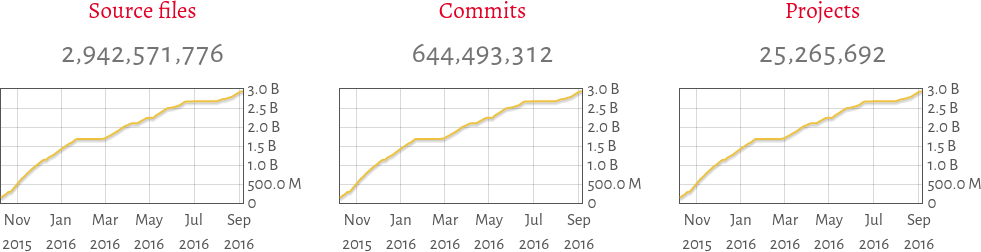

---
	title: Software Heritage
	author: Quentin Campos
	date: "\\today{}"
	fontsize: 12pt
...

# Introduction

##

Quentin Campos - M2 Génie Logiciel

<!-- ### Stage -->

Stage de fin d'études réalisé d'Avril à Septembre au sein de
**l'Inria**, dans le centre de recherche de Paris.

\center\includegraphics[width=8cm]{images/inria-paris.jpg}
<!--  -->

##

L'inria est un **institut public de recherche** fondé en 1967 dans le
cadre du plan calcul.

- Incube de nombreux projets
- Parmi lesquels de projets libres (Caml, IRILL, ...)

<!-- ## -->

<!-- - **Roberto Di Cosmo** : CEO -->
<!-- - **Stefano Zacchiroli** : CTO -->
<!-- - **Nicolas Dandrimont** : Développeur Core & Administrateur système -->
<!-- - **Antoine Dumont** : Développeur Core -->

##

Software Heritage est un projet **libre** dont le but est de
**collecter** le code source publiquement accessible, de le
**conserver** de manière pérenne, puis de le **diffuser** à la demande
au sein d'une bibliothèque hiérarchisée.

L'initiative à été lancée par Roberto Di Cosmo et Stefano Zacchiroli
au sein de l'Inria.

# Collect Preserve Share

## Archivage

**Parcourir** des sources à la recherche de contenu

**Télécharger** les contenus dans Software Heritage

**Vérifications** ponctuelles des sources pour vérifier si des mises à
jour sont effectuées

## Stockage

Les **fichier sources** sont enregistrés dans un **blob storage**
clef-valeur.

La **structure des dépôts** est enregistrée dans **la base de donnée**
où les informations sur l'agencement des fichiers source est stockée.

- Les **dépôts** sont enregistrés avec leur **historique** de
développement, en préservant tous leurs commits.
- Les **révisions** et **tarballs** sont enregistrées comme des
  **répertoires**.

## Distribution

Le site web permet de vérifier si un contenu est déjà archivé dans
Software Heritage.

Une API publique permet de faire des requêtes sur le stockage pour
télécharger un objet (répertoire, révision, dépôt, ...)

## Stockage



# Développement

## Archiver

\center 

## Archiver

\center 

## Storage

Les **fichiers source** sont enregistrés sur disque et **identifiés
par le sha1** de leur contenu.

Dans le stockage de fichiers, **l'arborescence** est basée sur la
**représentation hexadécimale** du sha1.

## Storage

<p></p>

### Exemple de storage

```
storage/
  af/
    e5/
      6b/
        afe56bd8...
        afe56ba0...
    d6/
      4b/
        afd64b22...
        afd642d3...
```

## Object Storage


## Software Heritage Vault

Permet de faire une requête pour **télécharger un contenu** Software
Heritage dans son **format initial** (tarball, dépôt, ...)

La requête est effectuée **en amont**, puis lorsque la création du
***bundle*** est terminée, une **notification** est envoyée.

Le Vault est associé à un **cache** dans lequel les bundle déjà crées
sont déjà **disponibles directement**.

# Conclusion

## Conclusion

Enrichissant sur le plan **technique** : Python, Gestion de projet

Plongée dans le monde du **logiciel libre**

Projet ambitieux dont l'objectif est de devenir une **organisation
internationale indépendante**

## Conclusion : Post-stage

Devenir **contributeur** au sein du projet Software Heritage

Utiliser le projet pour de la **recherche** en Génie Logiciel
